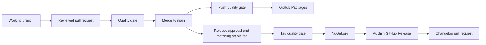

# Branching Strategy Playbook

## Current Automation

This guide describes [publish.yml](../../.github/workflows/publish.yml), not an
unconfigured versioning proposal. There is no NBGV setup, nightly schedule, or
automatic alpha/preview/RC version derived from a branch name.

| Event | Quality gate | Publication after success |
| --- | --- | --- |
| Pull request | Complete quality job | None |
| Merge queue | Complete quality job | None |
| Manual dispatch | Complete quality job | None |
| Push to main | Complete quality job | GitHub Packages |
| Push of a matching stable vX.Y.Z tag | Complete quality job and version check | NuGet.org |
| Push to another branch | No push trigger in this workflow | None |

The tag trigger is broader than the release policy: the quality job rejects tags
that are not stable `vX.Y.Z` or do not match every package's evaluated version.
A stable tag does not also publish to GitHub Packages; that step is main-only.

## Branch Policy

Use main for integration. Develop changes on short-lived branches and merge through
reviewed pull requests. Optional release branches can isolate stabilization, but
their names do not change versions or enable publication. Open a pull request or
use manual dispatch to run this quality workflow for another branch.

Passing checks and review are the intended merge policy. Administrators must
configure required checks and branch protection separately; a workflow file does
not prove those settings are enabled.

## Version And Release Preparation

1. Choose the intended package version and set it in repository configuration.
   Check every package's evaluated PackageVersion, including any overrides.
2. Complete review and quality verification for the intended release commit.
   Do not use historical build/coverage artifacts as proof for a new revision.
3. After release approval, create a matching stable tag on that commit and push it.
4. Verify the tag quality job, exact artifact manifest, and NuGet.org publication.

Tags never assign or rewrite versions. Both feeds use `--skip-duplicate`, so
reusing a version cannot overwrite an existing package. Choose a new version for
changed package contents.

Publication uses only validated archives from the same workflow run. The publishing
job rechecks the exact manifest before publishing; it does not rebuild or execute
repository scripts. GitHub Packages needs repository-token publishing permission;
NuGet.org needs `NUGET_API_KEY`. Actual hosted execution, permissions, and required
checks remain external acceptance items in the
[local checkpoint](../planning/local-verification-20260910.md).

## Changelog

[update_changelog.yml](../../.github/workflows/update_changelog.yml) responds to a
GitHub Release being published and opens a changelog pull request. Pushing a Git tag
alone does not run that workflow. Review and merge the resulting PR after publishing
the Release; prepare release notes before tagging.

## Flow

## Related Guides

- [Release checklist](release-checklist.md)
- [CI quality and publishing](../../.infra/yaml/README.md)
- [Quarterly review](quarterly-radar-review.md)
- [Technology radar](../best-practices/radar.md)
